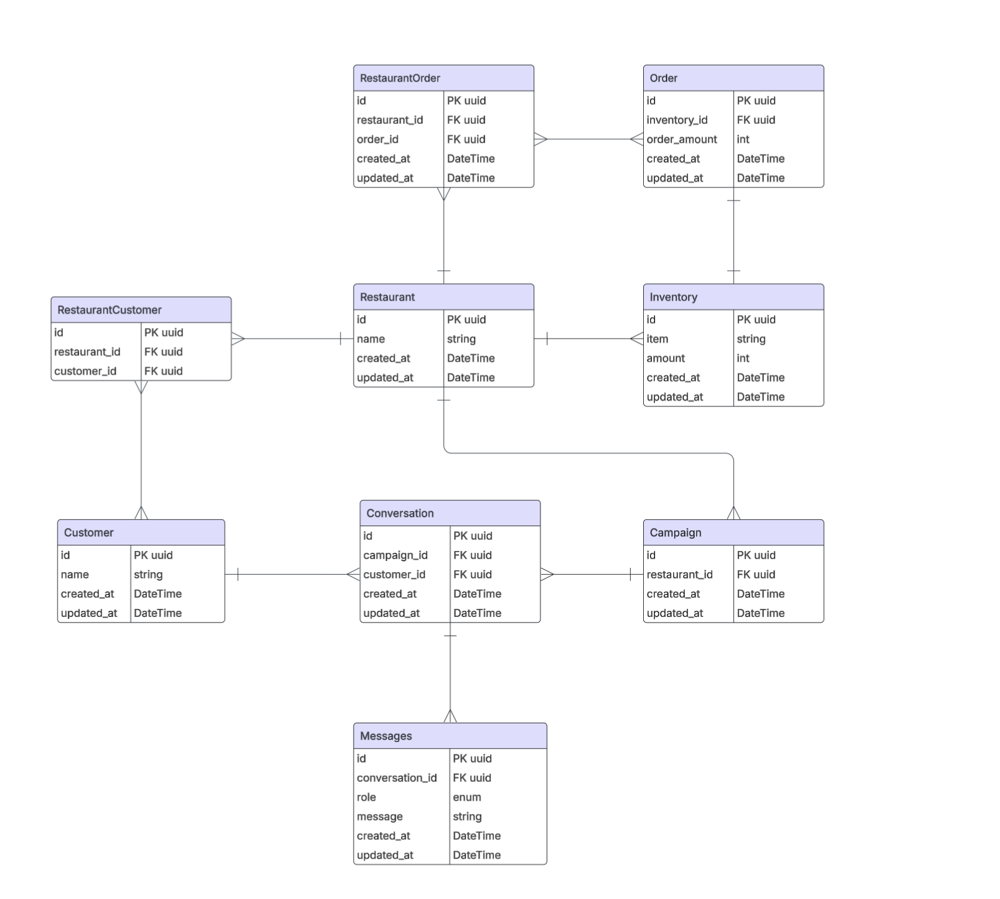

# Future-Proof Restaurant Backend

A powerful REST API backend for the Future-Proof restaurant inventory prediction and management system. This application helps restaurants predict inventory needs, manage promotions, and optimize stock levels.

## Table of Contents

- [Technology Stack](#technology-stack)
- [Project Structure](#project-structure)
- [Getting Started](#getting-started)
  - [Prerequisites](#prerequisites)
  - [Installation with Docker](#installation-with-docker)
  - [Manual Installation](#manual-installation)
- [Database](#database)
  - [Models](#models)
  - [Entity Relationship Diagram (ERD)](#entity-relationship-diagram-erd)
  - [Migrations](#migrations)
  - [Seeding](#seeding)
- [API Endpoints](#api-endpoints)
  - [Restaurant](#restaurant-endpoints)
  - [Inventory](#inventory-endpoints)
  - [Forecast](#forecast-endpoints)
  - [Inventory Forecast](#inventory-forecast-endpoints)
  - [Promotion](#promotion-endpoints)
  - [Campaign](#campaign-endpoints)
  - [Order](#order-endpoints)
- [Utility Scripts](#utility-scripts)
- [Development](#development)

## Technology Stack

- **Python 3.9**: Core programming language
- **FastAPI**: Modern, high-performance web framework for building APIs
- **SQLAlchemy**: SQL toolkit and Object-Relational Mapping (ORM) library
- **PostgreSQL**: Relational database for data storage
- **Alembic**: Database migration tool
- **Pydantic**: Data validation and settings management
- **Docker & Docker Compose**: Containerization for easy deployment
- **Uvicorn**: ASGI server for running the application

## Project Structure

```
backend/
├── app/                   # Application package
│   ├── api/               # API routes and endpoints
│   │   └── api_v1/        # API version 1
│   │       ├── endpoints/ # API endpoints by feature
│   │       └── api.py     # API router definition
│   ├── db/                # Database related code
│   │   ├── models.py      # SQLAlchemy models
│   │   ├── init_db.py     # Database initialization
│   │   ├── seed_db.py     # Database seeding
│   │   └── session.py     # Database session management
│   ├── schemas/           # Pydantic models/schemas
│   └── main.py            # FastAPI application entry point
├── migrations/            # Alembic migrations
├── .env                   # Environment variables (not in version control)
├── .env.example           # Example environment variables
├── alembic.ini            # Alembic configuration
├── docker-compose.yml     # Docker Compose configuration
├── Dockerfile             # Docker container definition
├── main.py                # Application entry point
├── requirements.txt       # Python dependencies
├── run_migrations.py      # Script for running migrations
└── seed_database.py       # Script for seeding the database
```

## Getting Started

### Prerequisites

- Docker and Docker Compose (for containerized setup)
- Python 3.9+ (for local development)
- PostgreSQL (for local development without Docker)

### Installation with Docker

1. Clone the repository

2. Navigate to the backend directory

```bash
cd future-proof/backend
```

3. Create a `.env` file using the example

```bash
cp .env.example .env
```

4. Start the application using Docker Compose

```bash
docker compose up
```

The API will be available at http://localhost:8000. The automatic database initialization will create all necessary tables and seed the database with sample data if it's empty.

### Manual Installation

1. Clone the repository and navigate to the backend directory

2. Create a virtual environment and activate it

```bash
python -m venv .venv
source .venv/bin/activate  # On Windows: .venv\Scripts\activate
```

3. Install dependencies

```bash
pip install -r requirements.txt
```

4. Create a `.env` file using the example

```bash
cp .env.example .env
```

5. Edit the `.env` file to match your PostgreSQL configuration

6. Run the application

```bash
uvicorn app.main:app --reload
```

The API will be available at http://localhost:8000.

## Database

### Models

The application uses the following key database models:

- **Restaurant**: Restaurants in the system
- **Inventory**: Inventory items for restaurants
- **Campaign**: Promotional campaigns
- **Customer**: Restaurant customers
- **Conversation**: Conversations for campaigns
- **Messages**: Messages in conversations
- **Order**: Orders for inventory items

### Entity Relationship Diagram (ERD)



*For a clearer view, see the ERD file in the db directory*

This diagram illustrates the relationships between the main entities in the system:

- A **Restaurant** has many **Inventory** items and **Campaigns**
- A **Campaign** has many **Conversations** with **Customers**
- Each **Conversation** contains **Messages**
- **Orders** are placed for **Inventory** items
- **RestaurantCustomer** and **RestaurantOrder** are junction tables that manage many-to-many relationships

### Migrations

Database migrations are managed with Alembic. Run migrations with:

```bash
python run_migrations.py
```

### Seeding

The database is automatically seeded with sample data when empty. To manually seed or reset the database:

```bash
# To reset and seed the database
python app/db/reset_db.py --drop --seed

# To only reset the database (drop all tables)
python app/db/reset_db.py --drop

# To only seed the database (without dropping tables)
python app/db/reset_db.py --seed
```

## API Endpoints

### Restaurant Endpoints

- **GET** `/api/v1/restaurant/`: Get all restaurants
- **GET** `/api/v1/restaurant/{restaurant_id}`: Get a specific restaurant
- **POST** `/api/v1/restaurant/`: Create a new restaurant

### Inventory Endpoints

- **GET** `/api/v1/inventory/restaurant/{restaurant_id}`: Get inventory for a restaurant
- **POST** `/api/v1/inventory/restaurant/{restaurant_id}`: Create a new inventory item
- **PUT** `/api/v1/inventory/{inventory_id}`: Update an inventory item

### Forecast Endpoints

- **GET** `/api/v1/forecast/`: Get sales forecast data

### Inventory Forecast Endpoints

- **GET** `/api/v1/inventory-forecast/restaurant/{restaurant_id}`: Get inventory forecast for a restaurant

### Promotion Endpoints

- **GET** `/api/v1/promotion/restaurant/{restaurant_id}`: Get promotions for a restaurant

### Campaign Endpoints

- **POST** `/api/v1/campaign/{restaurant_id}`: Create a new campaign

### Order Endpoints

- **GET** `/api/v1/order/restaurant/{restaurant_id}`: Get orders for a restaurant
- **POST** `/api/v1/order/restaurant/{restaurant_id}`: Create a new order

## Utility Scripts

- **run_migrations.py**: Run database migrations
- **app/db/reset_db.py**: Reset and/or seed the database
- **app/db/seed_db.py**: Seed the database with sample data

## Development

### API Documentation

The API documentation is available at:

- Swagger UI: http://localhost:8000/docs
- ReDoc: http://localhost:8000/redoc

### Code Organization

- **Models**: Database models are in `app/db/models.py`
- **Schemas**: Pydantic schemas for validation are in `app/schemas/`
- **Endpoints**: API endpoints are in `app/api/api_v1/endpoints/`

### Auto-Seeding Feature

The application automatically checks if the database is empty during startup. If it is, it will seed the database with sample data to provide a better initial experience.
